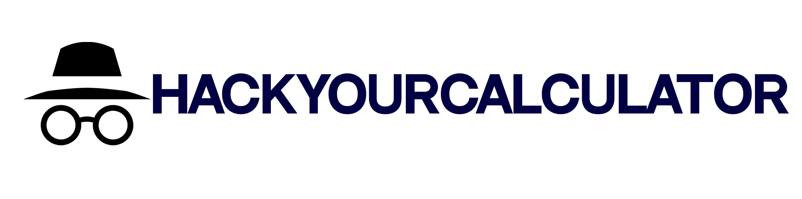

  <picture>
    <source media="(prefers-color-scheme: dark)" srcset="./resources/banner.png">
    
  </picture>

**ВНИМАНИЕ! ПРОГРАММА НЕ ЯВЛЯЕТСЯ НАСТОЯЩИМ ШИФРОВЩИКОМ ТЕКСТА, А ВСЕГО ЛИШЬ ПРОГРАММОЙ ДЛЯ РАЗВЛЕНЧЕНИЯ**

## Описание
**HackYourCalculator** - Эта программа предназначена для шифрования текста в цифры. Написана на python с использованием customtkinter. Проект создан в PyCharm.

## Системные требования:
- OC Windows 10/11
- 2GB оперативной памяти
- 5MB свободного места на диске

_К версии 1.1_

## Информация
- Проект создан на языке Python
- Поддерживает языки: Русский
- Поддержка Windows 10/11
- Создан на основе Customtkinter
- MIT License

## FAQ
### КАК ПОЛЬЗОВАТЬСЯ?
> В окне запущенной программы в поле ввода введите
любое слово на английском языке, затем нажмите
кнопку "Шифровать..." и программа выдаст вам зашифрованный
текст. Для расшифровки воспользуйтесь файлом data.xlsx

### Почему так мало символов для шифровки?
> Потому что этот шифровщик не предназначен для
   полной безопасной шифровки текста, а предназначен
   для прикола, вы сможете развести друзей послав им
   сообщение на их калькуляторе просто введя полученный
   результат.
   
### Где посмотреть историю шифрования?
> В файле history.txt который находится в папке с программой.

**@WaysoonProgramms 2023**
